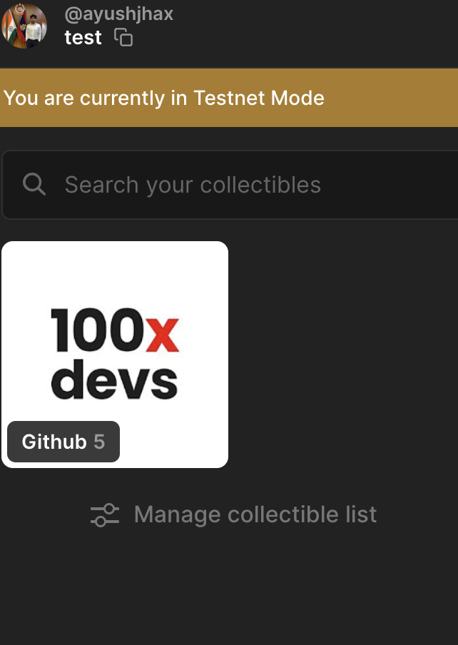
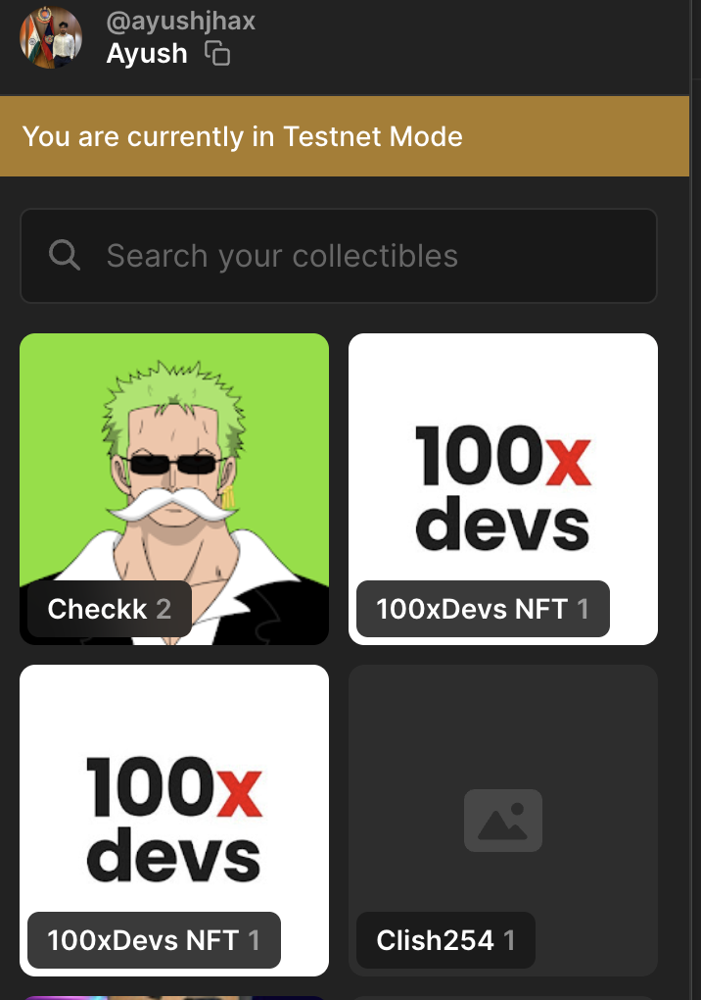

# Compressed NFTs


Topics in this exercise:
- Elixir cnft
- TypeScript
- Merkle Tree
- Compressed NFT
- Metaplex
- Bubblegum


**Table of contents:**
<!-- TOC -->

- [Compressed NFTs](#compressed-nfts)
	- [Installation](#installation)
	- [Overview](#overview)
	- [Settings](#settings)
	- [Usage](#usage)
	- [Tree repository](#tree-repository)
	- [Metadata](#metadata)
		- [cNFT Collection Metadata](#cnft-collection-metadata)
		- [cNFT item metadata](#cnft-item-metadata)
		- [Some references about metadata](#some-references-about-metadata)
	- [Metaplex dependancies versions](#metaplex-dependancies-versions)
	- [Some traces of my first attempts to mint cNFTs](#some-traces-of-my-first-attempts-to-mint-cnfts)
	- [Resources](#resources)

<!-- /TOC -->


## Installation

**Clone the repo:**

```bash
git clone https://github.com/Ayushjhax/cnft.git
```

**Path**
```bash
cd cnft_elixir
```
**Set up Rust toolchain:**

```bash
curl --proto '=https' --tlsv1.2 -sSf https://sh.rustup.rs | sh
```

**Initialize Rust NIFs:**
```bash
cd native/c_nft_nifs && cargo build --release
```


**To install dependencies:**

```bash
mix deps.get
```

**To run:**

```bash
# Create collection
mix run -e "Cnft.create_collection()"

# Create Merkle tree
mix run -e "Cnft.create_merkle_tree()"

# Mint cNFTs
mix run -e "Cnft.mint_cnft()"
```

Initially i created these in the Typescript and with elixir i am still having some problem(Still in Progress) commands to run that are below:

## Installation

**Clone the repo:**

```bash
git clone https://github.com/Ayushjhax/cnft.git
```
Install **bun** if needed

`curl -fsSL https://bun.sh/install | bash`

`bun --help`

**To install dependencies:**

```bash
bun install
```

**To run:**

```bash
bun run index.ts
```

This project was created using `bun init` in bun v1.1.20. [Bun](https://bun.sh) is a fast all-in-one JavaScript runtime.

If you occure this problem: `bigint: Failed to load bindings, pure JS will be used (try npm run rebuild?)`, resolve it by running the following command `npm rebuild`


## Overview

**Compressed NFTs** on Solana are a more scalable, cost-efficient way to mint and manage NFTs, using off-chain storage with on-chain proofs via **Merkle trees**. Here's how it works:

- **Merkle Tree**: A data structure that stores compressed proofs on-chain for efficient verification. Created using the `createTree()` call from `metaplex/bubblegum`, it allows for a compact, secure representation of many NFTs.

- **NFT Collection**: Defines a group of related NFTs. Created with the `createNft()` call from `metaplex`, it sets up metadata and ownership details for the collection.

- **Minting**: The process of adding new NFTs to a collection. This is done with `mintToCollectionV1()` from `metaplex/bubblegum`, allowing efficient addition of multiple NFTs to a **collection** using the **Merkle tree** structure.

Compressed NFTs enable large-scale minting with reduced costs, making them ideal for high-volume use cases like gaming and digital collectibles.


## Settings

Update the different fields and values in the following files:

### ".env" file

1. Specify wich kind of **environnment** you will use `production` or `developement`
2. Set your **Helius API key** (_[Dashboard | Helius](https://dashboard.helius.dev/dashboard)_) if you have one, else stay with the current RPC URL of Solana...

```
NODE_ENV=developement
SOLANA_MAINNET_RPC_URL=https://rpc.helius.xyz/?api-key=<HELIUS_API_KEY>
SOLANA_DEVNET_RPC_URL=https://devnet.helius-rpc.com/?api-key=<HELIUS_API_KEY>
```

### "key.json" file

Put "key.json" file at project root, this will be the payer wallet (_Format of the json file generated by `solana-keygen grind` command_)

### "config.ts" file

There is several fields to set:
- `MERKLE_MAX_DEPTH` : parameter specifies the maximum height of the Merkle tree, which dictates the total number of NFTs (or leaves) it can hold. To accommodate 37 NFTs, we need the smallest `maxDepth`.

  Let's compute this:
  - 2^5 = 32 (too small)
  - 2^6 = **64** (sufficient)

  So, the smallest depth that can hold 37 NFTs seems to be `maxDepth = 6`.

  **But** there's only some **specific couple of values** for `MERKLE_MAX_DEPTH` and `MERKLE_MAX_BUFFER_SIZE` who seems to be authorized for the Merkle Tree !

  See: [solana-program-library/account-compression/programs/account-compression/src/state/concurrent_merkle_tree_header.rs](https://github.com/solana-labs/solana-program-library/blob/master/account-compression/programs/account-compression/src/state/concurrent_merkle_tree_header.rs#L160))

  ```rust
  /// Initialization parameters for an SPL ConcurrentMerkleTree.
  ///
  /// Only the following permutations are valid:
  ///
  /// | max_depth | max_buffer_size       |
  /// | --------- | --------------------- |
  /// | 14        | (64, 256, 1024, 2048) |
  /// | 20        | (64, 256, 1024, 2048) |
  /// | 24        | (64, 256, 512, 1024, 2048) |
  /// | 26        | (64, 256, 512, 1024, 2048) |
  /// | 30        | (512, 1024, 2048) |
  ```
  So i choose the following couple of values (**14**, **64**) for `MERKLE_MAX_DEPTH` and `MERKLE_MAX_BUFFER_SIZE` !


- Two off-chain JSON file metadata, URL to set (_see section "Metadata" below_)
  - `METADATA_COLLECTION_URL` for the collection
  - `METADATA_ITEM_URL` for each items minted (_can be updated between each one_)
- `IMAGE_URL` : Image URL of the cNFT
- Name, symbol and description of the collection
- `FEE_PERCENT` : The royalties shared by the creators in basis points (_550 means 5.5% royalties_)
- `EXTERNAL_URL` : URI pointing to an external URL defining the asset (_the creator's website for example_)

```typescript

export const MERKLE_MAX_DEPTH       = 14;
export const MERKLE_MAX_BUFFER_SIZE = 64;

export const METADATA_COLLECTION_URL = "https://gist.githubusercontent.com/Ayushjhax/5eb6c0cb31e506d68ff0418dc704669a/raw/72b62a4f6fdb65b56f1ec47c4edd99a16a7f4979/cnft_metadata.json";
export const METADATA_ITEM_URL       = "https://gist.githubusercontent.com/Ayushjhax/fd65289fa8ab637d4fa1b5f9226334c7/raw/c3d1c438b90b78a4447b545c4cc4cbd55ad3637d/cnft_item_metadata.json";
export const IMAGE_URL               = "https://pbs.twimg.com/profile_images/1877817218244775936/zYaaUHgY_400x400.jpg";

export const COLLECTION_NAME        = '100xDevs Collection'
export const COLLECTION_SYMBOL      = '100xDevs'
export const COLLECTION_DESCRIPTION = '100xDevs Bounty Attempted by Ayush'
export const FEE_PERCENT            = 0
export const EXTERNAL_URL           = 'https://github.com/Ayushjhax'
export const CREATORS               = [
  {
    address: publicKey('ayEwtx4SbkdoyF7i7rA3Ygq7qkVsaJTr3JhQocdibn7'),
    verified: false,
    share: 100,
  },
]

export const NFT_ITEM_NAME      = 'Ayush Limited Edition'
export const NFT_ITEM_IMAGE_URL = IMAGE_URL;


```


### "addresses.csv" file

Prepare a list of Solana wallet addresses for the airdrop, in a CSV file.

The CSV file should contain a single column with the header "address", and each row should contain a valid Solana wallet address.

**Example :**

```csv
address
JCsFjtj6tem9Dv83Ks4HxsL7p8GhdLtokveqW7uWjGyi
EfWsg4nbb7KXkCoTRbWfkzyfcSECFueZXtxYPxTuJkyB
HG2SQgjkftPvry8DFMgsQvcJraXq4SXf6yhScZ8cCUJU
7pYzYfG8X9bRDj2bw34ntwSQ6vGtJQFY1o9mKbWpzDeU
5HgMh9VgTbXLyb4FfVUMxgxhPkdRaVvjzBJeGLyx9Uxg
5AEfZpzDQwBszimu2JEY88kMqYjCygUWVQwN1GhXFv1D
```

## Usage

After set all required parameters and data as seen in previous section.

We can run the processus...
1. At first we create the cNFT collection : `bun run 1_createNFTCollection.ts`
2. Then creating the Merkle Tree : `bun run 2_createMerkleTree.ts`
3. This program read a CSV file with all the addresses to airdrop : `bun run 3_mintCNFT.ts`

Each call generate a "file" in data directory, to keep a trace of the processus These data are used cross programs too...


## Metadata

### cNFT Collection Metadata

```json
{
	"name"                   : "100xDevs NFT",
	"symbol"                 : "100xDevs",
	"description"            : "100xDevs Bounty Attempt by Ayush",
	"seller_fee_basis_points": 0,
	"image"                  : "https://pbs.twimg.com/profile_images/1877817218244775936/zYaaUHgY_400x400.jpg",
	"external_url"           : "https://github.com/Ayushjhax",
	"attributes"             : [],
	"collection"             : {
		"name"  : "Ayush cNFT Collection",
		"family": "Ayush cNFTs"
	},
	"properties": {
		"files": [
			{
				"uri" : "https://pbs.twimg.com/profile_images/1877817218244775936/zYaaUHgY_400x400.jpg",
				"type": "image/png"
			}
		],
		"category": "image"
	}
}
```

### cNFT item metadata

```json
{
	"name"                   : "100xDevs NFT",
	"symbol"                 : "100xDevs",
	"description"            : "100xDevs Bounty Attempt by Ayush",
	"seller_fee_basis_points": 0,
	"image"                  : "https://res.cloudinary.com/djohjwkn6/image/upload/v1741644237/100xDevs_tv6ozv.jpg",
	"external_url"           : "https://github.com/Ayushjhax",
	"attributes"             : [
		{
			"trait_type": "Bounty",
			"value"     : "Superteam"
		},
		{
			"trait_type": "Sponsored By",
			"value"     : "100xDevs"
		},
		{
			"trait_type": "Attempted by",
			"value"     : "Ayush Kumar Jha"
		},
		{
			"trait_type": "Status",
			"value"     : "Yeah!"
		},
		{
			"trait_type": "Mint date",
			"value"     : "2025-03-12"
		}
	],
	"collection": {
		"name"  : "Ayush cNFT Collection",
		"family": "Ayush cNFTs"
	},
	"properties": {
	  "files": [
		{
			"uri" : "https://res.cloudinary.com/djohjwkn6/image/upload/v1741644237/100xDevs_tv6ozv.jpg",
			"type": "image/png"
		}
	  ],
	  "category": "image"
	},
	"creators": {
		"address" : "ayEwtx4SbkdoyF7i7rA3Ygq7qkVsaJTr3JhQocdibn7",
		"verified": false,
		"share"   : 100
	}
  }
```

### Some references about metadata
- [Overview | Token Metadata](https://developers.metaplex.com/token-metadata)
- [How to Create a NFT On Solana | Token Metadata Guides](https://developers.metaplex.com/token-metadata/guides/javascript/create-an-nft)
- [Solana NFT Metadata Deep Dive](https://www.quicknode.com/guides/solana-development/nfts/solana-nft-metadata-deep-dive)


## Metaplex dependancies versions

```json
"@metaplex-foundation/mpl-bubblegum":            "^1.0.1",
"@metaplex-foundation/mpl-token-metadata":       "^3.0.0",
"@metaplex-foundation/umi-bundle-defaults":      "^0.8.9",
"@metaplex-foundation/umi-uploader-nft-storage": "^0.8.9",
```


## Some traces of my first attempts to mint cNFTs

**Addresses, Accounts, TX and scrrenshot:**

- [**MerkleTree**](https://explorer.solana.com/address/FuvU1fGEgxeyXqt8PQiusoFaZ5mEXNeDXCC8kk5JJtwZ?cluster=?cluster=devnet)
- [**NFT Collection**](https://explorer.solana.com/address/73Wrv7FqPQHLoynfxS5Gk6qaW4WzbtyQh5yhTzyJ116p?cluster=?cluster=devnet)
- [**cNFT mint 1**](https://explorer.solana.com/address/D8YxPmLw7dvemKdBUBHUjXQfxW4TCRJ8yvgjCF9giwEx?cluster=?cluster=devnet)

- **cNFt inside Phantom wallet**
  
   


## Resources

- [Creating Compressed NFTs with JavaScript | Solana](https://solana.com/developers/guides/javascript/compressed-nfts)
- [All You Need to Know About Compression on Solana](https://www.helius.dev/blog/all-you-need-to-know-about-compression-on-solana) (_The most detailed blog on Solana's compression_)
- [Exploring NFT Compression on Solana](https://www.helius.dev/blog/solana-nft-compression) (_All about specifically NFT compression (cNFTS)_)
- [Overview | Bubblegum](https://developers.metaplex.com/bubblegum) (_Metaplex's Bubblegum program's docs_)
- [compressed.app - estimate costs for compressed NFTs](https://compressed.app/)

**Metaplex/Bubblegum:**

- [Overview | Bubblegum](https://developers.metaplex.com/bubblegum)
- [GitHub - metaplex-foundation/mpl-bubblegum: Create and manage Metaplex compressed NFTs](https://github.com/metaplex-foundation/mpl-bubblegum)
- [@metaplex-foundation/mpl-bubblegum - v4.2.1](https://mpl-bubblegum-js-docs.vercel.app/)

**Solandy videos:**

- [What is a Merkle Tree? How does Account Compression work? [Solana Tutorial] - Mar 22nd '23 - YouTube](https://www.youtube.com/watch?v=6BpArf2-R68)
- [How Compressed NFTs work on Solana - Mar 30th '23 - YouTube](https://www.youtube.com/watch?v=ayZUsq6eLzQ)
  - [GitHub - metaplex-foundation/compression-read-api-js-examples](https://github.com/metaplex-foundation/compression-read-api-js-examples)
  - [compression-read-api-js-examples/index.ts at master · metaplex-foundation/compression-read-api-js-examples · GitHub](https://github.com/metaplex-foundation/compression-read-api-js-examples/blob/master/index.ts#L464)
  - [Minting a tree for compressed NFTs - DEV Community](https://dev.to/apollotoday/minting-a-tree-for-compressed-nfts-13n7)
- [How to Mint and Transfer compressed NFTs [Solana Tutorial] - Apr 14th '23 - YouTube](https://www.youtube.com/watch?v=83nIhnxtlW8)
  - [video-tutorial-resources/cnfts at main · loopcreativeandy/video-tutorial-resources · GitHub](https://github.com/loopcreativeandy/video-tutorial-resources/tree/main/cnfts)
- [Compressed NFTs Deep Dive: What you need to know before you mint! [Solana Tutorial] - June 3rd '23 - YouTube](https://www.youtube.com/watch?v=nM3trQX2_5o)

**Misc:**

- [Account Compression Program](https://spl.solana.com/account-compression)
- [Core Concepts](https://spl.solana.com/account-compression/concepts)
- [Example usage of the TS SDK](https://spl.solana.com/account-compression/usage)
- [solana-program-library/account-compression/programs at master · solana-labs/solana-program-library · GitHub](https://github.com/solana-labs/solana-program-library/tree/master/account-compression/programs)
- [Merkle Trees Visualization](https://efficient-merkle-trees.netlify.app/)
- [How to mint compressed NFTs](https://medium.com/@laloutre/how-to-mint-compressed-nfts-dfcbee0ef51e)

--------